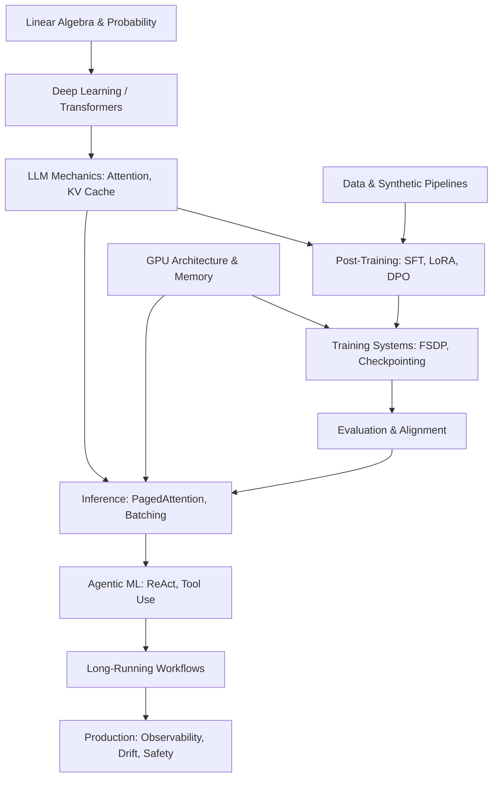

# 00_ROLE_ANALYSIS — ML Engineer (LLM & Agentic Systems)

## 1. Role Context & Core Hypothesis

**Role Context:** This role targets building a proactive AI assistant that executes real-world tasks, performs multi-step reasoning, interacts with external tools, and handles long-running workflows with high reliability under production constraints.

**Core Interview Hypothesis:** "Can this candidate take an ML/LLM research idea, turn it into a trainable system, adapt it effectively, deploy it efficiently, integrate it into an agentic product, measure whether it actually works, debug it in production, and continuously improve it under latency, cost, reliability, and safety constraints?"

The ML execution layer sits exactly at the boundary of Research, Systems Engineering, and Product Outcomes. The candidate must span these seamlessly.

---

## 2. Role Decomposition

### Explicit Technical Requirements
- Python, PyTorch, JAX
- GPU-based training and inference architecture
- SFT, LoRA, QLoRA, DPO, Distillation
- Data pipelines (real & synthetic)
- Evaluation systems and latency/cost optimization

### Implicit Technical Requirements
- **Hardware/Software Co-design Awareness**: Understanding how PyTorch ops map to CUDA kernels and memory bandwidth bounds.
- **Probabilistic Engineering**: Building deterministic, reliable long-running workflows on top of inherently non-deterministic LLM behavior.

### Principal-Level Requirements
- **Architectural Judgment**: Knowing when to use full fine-tuning vs. LoRA vs. Prompt Engineering vs. Distillation based on data scale and latency budgets.
- **Incident Leadership**: Ability to trace a 99th percentile (P99) latency spike from the network layer down to KV-cache fragmentation on a specific GPU.

---

## 3. Role Competency Model & Priority Matrix

| Category | Topics | Priority | Rationale / Depth Required |
| :--- | :--- | :--- | :--- |
| **Agentic ML Systems** | ReAct, Tool Routing, Context/Memory | **P0** | Core to the product. Must reach Level 10 (Principal Reasoning). |
| **Long-Running Workflows** | State persistence, Idempotency, Retries | **P0** | Essential for reliable proactive assistants. |
| **Post-Training** | SFT, LoRA, DPO, Distillation | **P0** | Primary method for aligning general models to product tasks. |
| **LLM & Inference** | KV Cache, PagedAttention, Speculative Decoding | **P0** | Determines unit economics, TTFT, and user experience. |
| **GPU Architecture** | SMs, HBM, Memory Bandwidth, Tensor Cores | **P0** | Cannot optimize what you don't mechanistically understand. |
| **Evaluation & Reliability** | LLM-as-judge, Canarying, System vs Model metrics | **P0** | Prevents silent regression in production. |
| **Training Systems** | PyTorch Autograd, Mixed Precision, DDP/FSDP | **P1** | Needed to scale training efficiently without OOMs. |
| **Data Engineering** | Synthetic Data, Pipeline Contamination | **P1** | The highest-leverage lever for model quality improvement. |
| **Observability** | Profiling, Tracing, Distributed Debugging | **P1** | Required to resolve production incidents quickly. |
| **Systems / ML Design** | Architecture tradeoffs, Cost/Latency scaling | **P1** | Critical for a Technical Lead overseeing the platform. |
| **Deep Learning** | Attention, Transformers, Cross-Entropy | **P1** | Foundational mechanistic understanding required. |
| **Classic ML & Python** | Concurrency, Algorithms, Basic Stats | **P2** | Supporting knowledge; expected but less differentiating. |

---

## 4. Internal Dependency Graph

A senior engineer must understand how decisions at the bottom of the stack cascade to the top.

---

## 5. Depth Philosophy & Technical Bridge

Every subsequent document generated in this Single Source of Knowledge (SSK) will follow the **10-Level Depth Framework**, bridging Mathematics → Algorithm → GPU Execution → Production Systems.

*Next, we will proceed to generate `02_MACHINE_LEARNING_FOUNDATIONS.md` and `03_DEEP_LEARNING.md`, followed by the heavy P0 tracks.*
