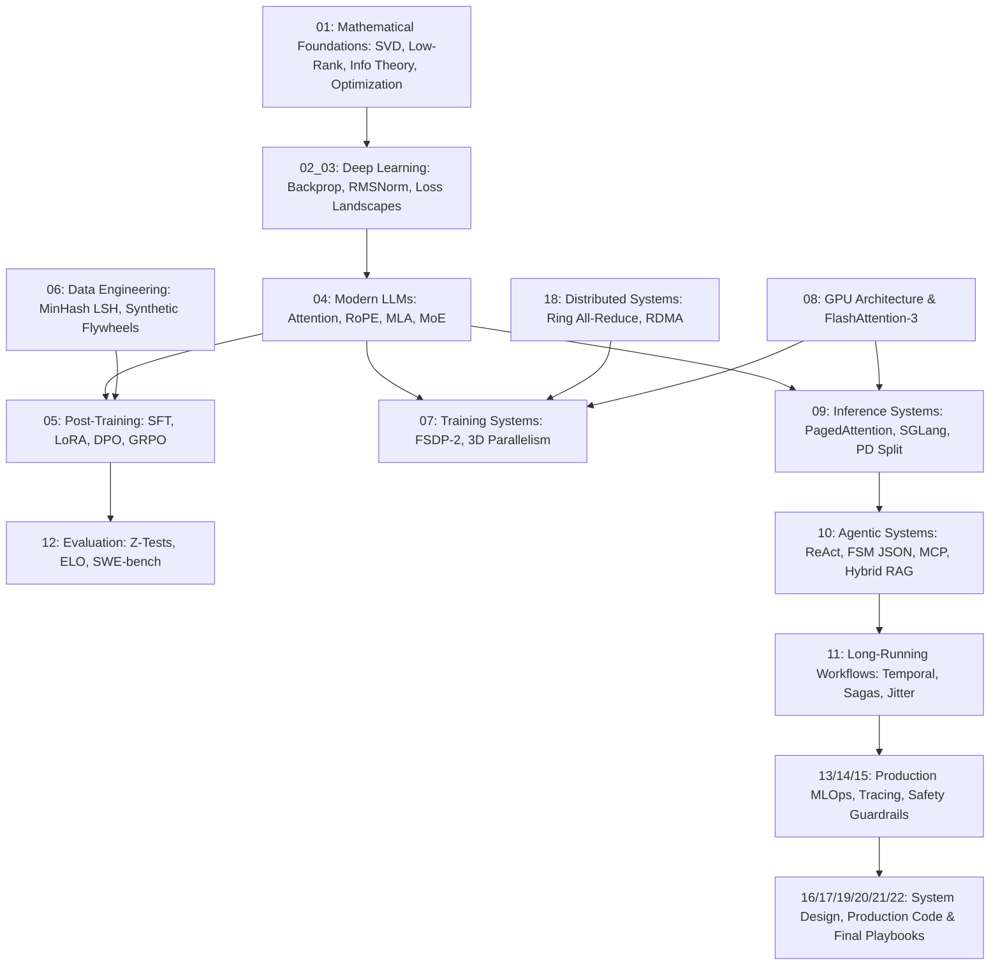

# 00_ROLE_ANALYSIS — ML Engineer (LLM & Agentic Systems)

## 1. Role Context & Core Hypothesis

**Role Context:** This role targets building a proactive AI assistant that executes real-world tasks, performs multi-step reasoning, interacts with external tools, and handles long-running workflows with high reliability under production constraints.

**Core Interview Hypothesis:** "Can this candidate take an ML/LLM research idea, turn it into a trainable system, adapt it effectively, deploy it efficiently, integrate it into an agentic product, measure whether it actually works, debug it in production, and continuously improve it under latency, cost, reliability, and safety constraints?"

The ML execution layer sits exactly at the boundary of Research, Systems Engineering, and Product Outcomes. The candidate must span these seamlessly.

---

## 2. Role Decomposition

### Explicit Technical Requirements
- Python, PyTorch, CUDA, Triton
- GPU-based training and inference architecture (vLLM, SGLang, Megatron-LM, FSDP-2)
- SFT, LoRA, QLoRA, DPO, GRPO (Reasoning Models)
- Data pipelines (MinHash LSH, Synthetic data curation, Decontamination)
- Evaluation systems (SWE-bench, GAIA, Statistical significance) and latency/cost optimization

### Implicit Technical Requirements
- **Hardware/Software Co-design Awareness**: Understanding how PyTorch ops map to CUDA kernels, SRAM tiling, and memory bandwidth bounds.
- **Probabilistic Engineering**: Building deterministic, reliable long-running workflows on top of inherently non-deterministic LLM behavior.

### Staff/Principal-Level Requirements
- **Architectural Judgment**: Knowing when to use full fine-tuning vs. LoRA vs. Prompt Engineering vs. Distillation vs. GRPO based on data scale and latency budgets.
- **Incident Leadership**: Ability to trace a 99th percentile (P99) latency spike from the network layer down to KV-cache fragmentation on a specific GPU.

---

## 3. Role Competency Model & Priority Matrix

| Priority | Category | Topics | Files |
| :---: | :--- | :--- | :--- |
| **P0** | **Agentic ML Systems** | ReAct, Tool Routing, Context/Memory, MCP, FSM JSON | [10_AGENTIC_ML_SYSTEMS.md](./10_AGENTIC_ML_SYSTEMS.md) |
| **P0** | **Long-Running Workflows** | Durable State, Temporal, Sagas, Idempotency, Retries | [11_LONG_RUNNING_WORKFLOW_RELIABILITY.md](./11_LONG_RUNNING_WORKFLOW_RELIABILITY.md) |
| **P0** | **Post-Training & Reasoning** | SFT, LoRA, QLoRA, DPO, GRPO, Test-Time Compute | [05_POST_TRAINING.md](./05_POST_TRAINING.md) |
| **P0** | **LLM & Inference** | PagedAttention, RadixAttention, PD Split, Chunked Prefill | [04_TRANSFORMERS_AND_LLMS.md](./04_TRANSFORMERS_AND_LLMS.md) · [09_INFERENCE_SYSTEMS.md](./09_INFERENCE_SYSTEMS.md) |
| **P0** | **GPU Architecture** | SMs, SRAM Tiling, FlashAttention-3, Roofline Model | [08_GPU_AND_PERFORMANCE.md](./08_GPU_AND_PERFORMANCE.md) |
| **P0** | **Evaluation & Reliability** | Z-Tests, ELO Ratings, SWE-bench, LLM-as-judge | [12_EVALUATION.md](./12_EVALUATION.md) |
| **P1** | **Mathematical Foundations** | SVD, Low-Rank, Information Theory, AdamW, Optimization | [01_MATHEMATICAL_FOUNDATIONS.md](./01_MATHEMATICAL_FOUNDATIONS.md) |
| **P1** | **Training Systems** | FSDP-2, 3D Parallelism, Context Parallelism, Checkpointing | [07_TRAINING_SYSTEMS.md](./07_TRAINING_SYSTEMS.md) |
| **P1** | **Data Engineering** | MinHash LSH, Model Collapse, Synthetic Curation | [06_DATA_AND_SYNTHETIC_DATA.md](./06_DATA_AND_SYNTHETIC_DATA.md) |
| **P1** | **Distributed Systems** | Ring All-Reduce, GPUDirect RDMA, InfiniBand NDR | [18_DISTRIBUTED_SYSTEMS.md](./18_DISTRIBUTED_SYSTEMS.md) |
| **P1** | **Observability** | Little's Law, MFU, OpenTelemetry Tracing | [14_OBSERVABILITY_AND_DEBUGGING.md](./14_OBSERVABILITY_AND_DEBUGGING.md) |
| **P1** | **Systems / ML Design** | Architecture Trade-offs, Cost/Latency Scaling | [16_SYSTEM_DESIGN.md](./16_SYSTEM_DESIGN.md) · [13_PRODUCTION_ML.md](./13_PRODUCTION_ML.md) |
| **P1** | **Deep Learning** | Backpropagation, Softmax Jacobians, LayerNorm/RMSNorm | [02_03_ML_AND_DL_FOUNDATIONS.md](./02_03_ML_AND_DL_FOUNDATIONS.md) |
| **P2** | **Python & Coding** | PyTorch Modules, FSM Parsers, Continuous Batching | [17_PYTHON_AND_CODING.md](./17_PYTHON_AND_CODING.md) |

---

## 4. Internal Dependency Graph

---

## 5. Depth Philosophy & Technical Bridge

Every document in this Single Source of Knowledge (SSK) follows the **10-Level Depth Framework**, bridging **Mathematics $\longleftrightarrow$ Algorithms $\longleftrightarrow$ GPU Execution $\longleftrightarrow$ Production Systems**.
