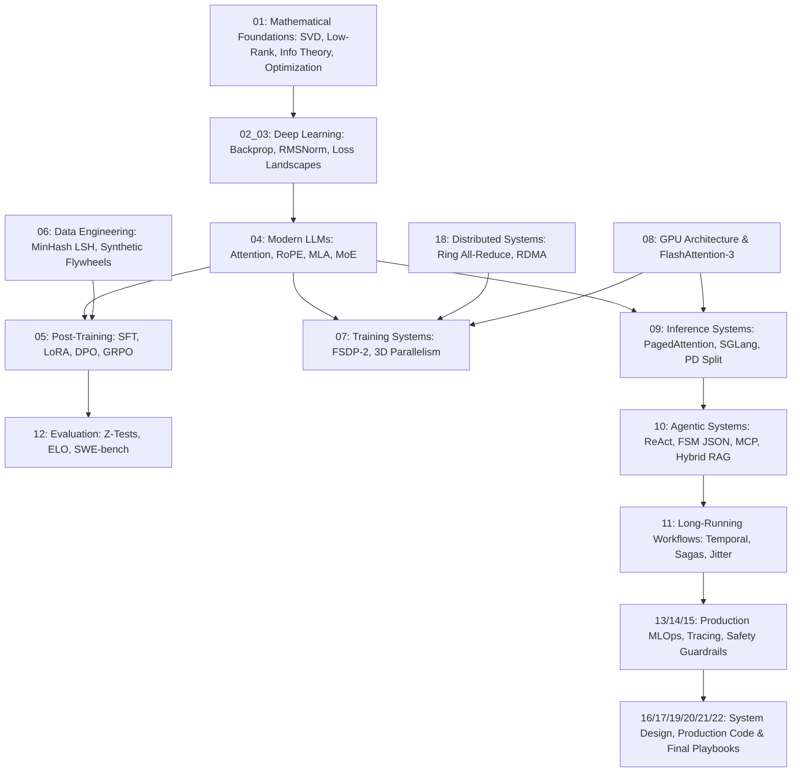

# 🧠 ML-Notes — Single Source of Knowledge (SSK)

> **A comprehensive, mathematically intensive, and production-grade master reference for ML Engineers (LLM & Agentic Systems).**  
> Bridging **Rigorous Mathematics $\longleftrightarrow$ Algorithms $\longleftrightarrow$ GPU Bare Metal $\longleftrightarrow$ Production Distributed Systems**.

🌐 **Live Web App (GitHub Pages)**: **[https://prajyotkore.github.io/ML-Notes/](https://prajyotkore.github.io/ML-Notes/)**  
*Features instant search, KaTeX mathematical formula rendering, Prism.js code syntax highlighting, and interactive Mermaid architecture diagrams.*

---

## 🎯 Purpose & Scope

This repository is an exhaustive, production-grade **Single Source of Knowledge (SSK)** built for engineers preparing for Senior, Staff, and Principal **ML Engineer (LLM & Agentic Systems)** technical interviews.

The core engineering standard this repo answers:

> *"Can this candidate take a frontier research concept, derive its mathematical formulations, map its operations to physical GPU memory hierarchies, scale its training and inference across distributed clusters, integrate it into a durable agentic system, and systematically debug latency, drift, and reliability failures in production?"*

Every document follows the **10-Level Depth Framework**, progressing from first principles and step-by-step mathematical proofs through to bare-metal CUDA execution and production system design.

---

## 📐 Complete Dependency Architecture

---

## 📊 Priority Matrix

| Priority | Category | Topics | Files |
|:---:|:---|:---|:---|
| **P0** | **Agentic ML Systems** | ReAct, Tool Routing, Context/Memory, MCP, FSM JSON | [10_AGENTIC_ML_SYSTEMS.md](./10_AGENTIC_ML_SYSTEMS.md) |
| **P0** | **Long-Running Workflows** | Durable State, Temporal, Sagas, Idempotency, Retries | [11_LONG_RUNNING_WORKFLOW_RELIABILITY.md](./11_LONG_RUNNING_WORKFLOW_RELIABILITY.md) |
| **P0** | **Post-Training & Reasoning** | SFT, LoRA, QLoRA, DPO, GRPO, Test-Time Compute | [05_POST_TRAINING.md](./05_POST_TRAINING.md) |
| **P0** | **LLM & Inference** | PagedAttention, RadixAttention, PD Split, Chunked Prefill | [04_TRANSFORMERS_AND_LLMS.md](./04_TRANSFORMERS_AND_LLMS.md) · [09_INFERENCE_SYSTEMS.md](./09_INFERENCE_SYSTEMS.md) |
| **P0** | **GPU Architecture** | SMs, SRAM Tiling, FlashAttention-3, Roofline Model | [08_GPU_AND_PERFORMANCE.md](./08_GPU_AND_PERFORMANCE.md) |
| **P0** | **Evaluation & Reliability** | Z-Tests, ELO Ratings, SWE-bench, LLM-as-judge | [12_EVALUATION.md](./12_EVALUATION.md) |
| **P1** | **Mathematical Foundations** | SVD, Low-Rank, Information Theory, AdamW, Optimization | [01_MATHEMATICAL_FOUNDATIONS.md](./01_MATHEMATICAL_FOUNDATIONS.md) |
| **P1** | **Training Systems** | FSDP-2, 3D Parallelism, Context Parallelism, Checkpointing | [07_TRAINING_SYSTEMS.md](./07_TRAINING_SYSTEMS.md) |
| **P1** | **Data Engineering** | MinHash LSH, Model Collapse, Synthetic Curation | [06_DATA_AND_SYNTHETIC_DATA.md](./06_DATA_AND_SYNTHETIC_DATA.md) |
| **P1** | **Distributed Systems** | Ring All-Reduce, GPUDirect RDMA, InfiniBand NDR | [18_DISTRIBUTED_SYSTEMS.md](./18_DISTRIBUTED_SYSTEMS.md) |
| **P1** | **Observability** | Little's Law, MFU, OpenTelemetry Tracing | [14_OBSERVABILITY_AND_DEBUGGING.md](./14_OBSERVABILITY_AND_DEBUGGING.md) |
| **P1** | **Systems / ML Design** | Architecture Trade-offs, Cost/Latency Scaling | [16_SYSTEM_DESIGN.md](./16_SYSTEM_DESIGN.md) · [13_PRODUCTION_ML.md](./13_PRODUCTION_ML.md) |
| **P1** | **Deep Learning** | Backpropagation, Softmax Jacobians, LayerNorm/RMSNorm | [02_03_ML_AND_DL_FOUNDATIONS.md](./02_03_ML_AND_DL_FOUNDATIONS.md) |
| **P2** | **Python & Coding** | PyTorch Modules, FSM Parsers, Continuous Batching | [17_PYTHON_AND_CODING.md](./17_PYTHON_AND_CODING.md) |

---

## 📚 Complete Document Index

### Phase 0 — Foundation & Architecture
| File | Description |
|:---|:---|
| [00_ROLE_ANALYSIS.md](./00_ROLE_ANALYSIS.md) | Role competency map, priority matrix, and full dependency graph |

---

### Phase 1 — Mathematical Foundations & Core Deep Learning
| File | Description |
|:---|:---|
| [01_MATHEMATICAL_FOUNDATIONS.md](./01_MATHEMATICAL_FOUNDATIONS.md) | Rigorous Linear Algebra, SVD, Low-Rank approximations, Probability, Information Theory, AdamW & Optimization Calculus |
| [02_03_ML_AND_DL_FOUNDATIONS.md](./02_03_ML_AND_DL_FOUNDATIONS.md) | Backpropagation Jacobian derivations, Softmax/Cross-Entropy gradients, RMSNorm vs. LayerNorm proofs, Residual additive highways |

---

### Phase 2 — Modern Transformers & LLM Architectures *(P0)*
| File | Description |
|:---|:---|
| [04_TRANSFORMERS_AND_LLMS.md](./04_TRANSFORMERS_AND_LLMS.md) | Scaled Attention variance proofs, RoPE/YaRN mathematical derivations, Multi-Head Latent Attention (MLA), DeepSeek-V3 MoE load balancing |

---

### Phase 3 — Post-Training, Alignment & Reasoning Models *(P0)*
| File | Description |
|:---|:---|
| [05_POST_TRAINING.md](./05_POST_TRAINING.md) | LoRA/QLoRA mathematical updates, step-by-step Bradley-Terry to DPO proof, GRPO & Policy Gradient math for reasoning models |
| [06_DATA_AND_SYNTHETIC_DATA.md](./06_DATA_AND_SYNTHETIC_DATA.md) | MinHash Jaccard estimation theorem, LSH S-curves, Model Collapse dynamics, Benchmark decontamination with Bloom filters |

---

### Phase 4 — GPU Hardware, Performance & Inference Engines *(P0)*
| File | Description |
|:---|:---|
| [08_GPU_AND_PERFORMANCE.md](./08_GPU_AND_PERFORMANCE.md) | NVIDIA H100 microarchitecture, Roofline Model derivations, SRAM block tiling & online softmax proofs in FlashAttention-1/2/3 |
| [09_INFERENCE_SYSTEMS.md](./09_INFERENCE_SYSTEMS.md) | PagedAttention virtual memory math, RadixAttention (SGLang), Disaggregated Prefill/Decode (PD Split), Speculative Decoding acceptance proofs |

---

### Phase 5 — Distributed Scaling & System Infrastructures
| File | Description |
|:---|:---|
| [07_TRAINING_SYSTEMS.md](./07_TRAINING_SYSTEMS.md) | Static training memory equations ($16\Phi$), ZeRO-1/2/3 sharding proofs, Megatron 3D Parallelism, 1F1B pipeline bubble fraction |
| [18_DISTRIBUTED_SYSTEMS.md](./18_DISTRIBUTED_SYSTEMS.md) | Ring All-Reduce communication proofs ($2(N-1)/N \cdot M$), Tree All-Reduce, GPUDirect RDMA, InfiniBand NDR network fabric |

---

### Phase 6 — Agentic ML Systems, Long-Running Workflows & Safety *(P0)*
| File | Description |
|:---|:---|
| [10_AGENTIC_ML_SYSTEMS.md](./10_AGENTIC_ML_SYSTEMS.md) | Chained reasoning failure math ($p^N$), FSM Grammar-Constrained logit biasing (Outlines/XGrammar), Model Context Protocol (MCP), Hybrid RRF |
| [11_LONG_RUNNING_WORKFLOW_RELIABILITY.md](./11_LONG_RUNNING_WORKFLOW_RELIABILITY.md) | Geometric retry math ($1-(1-p)^{R+1}$), Exponential Backoff with Full Jitter, Idempotency-Key gateways, Distributed Saga compensation |
| [15_SAFETY_AND_ROBUSTNESS.md](./15_SAFETY_AND_ROBUSTNESS.md) | Alignment Tax ROC curves, Direct & Indirect Prompt Injection vectors, Firecracker microVM sandboxing, Least-privilege IAM |

---

### Phase 7 — Production Evaluation, Observability & MLOps
| File | Description |
|:---|:---|
| [12_EVALUATION.md](./12_EVALUATION.md) | Two-Proportion Z-Tests, Sample sizing for MDE, Bradley-Terry ELO ratings (Chatbot Arena), LLM-as-a-Judge debiasing |
| [13_PRODUCTION_ML.md](./13_PRODUCTION_ML.md) | Population Stability Index (PSI) drift calculus, Canary/Shadow/Blue-Green deployments, Session pinning during rolling updates |
| [14_OBSERVABILITY_AND_DEBUGGING.md](./14_OBSERVABILITY_AND_DEBUGGING.md) | Little's Law ($L=\lambda W$), $M/M/k$ queue utilization walls, MFU calculations, OpenTelemetry distributed tracing schemas |

---

### Phase 8 — System Design, Production Code & Interview Synthesis
| File | Description |
|:---|:---|
| [16_SYSTEM_DESIGN.md](./16_SYSTEM_DESIGN.md) | End-to-end whiteboard architecture blueprints with full back-of-the-envelope calculations (100k QPS Serving, Durable Agent Runtimes, RAG) |
| [17_PYTHON_AND_CODING.md](./17_PYTHON_AND_CODING.md) | Production-grade runnable PyTorch modules: Multi-Head Latent Attention (MLA), RoPE/YaRN, FSM JSON Logit Processor, Continuous Batcher |
| [19_LEADERSHIP_AND_TECHNICAL_JUDGMENT.md](./19_LEADERSHIP_AND_TECHNICAL_JUDGMENT.md) | Staff/Principal engineering trade-off matrices, incident leadership protocols, and architectural arbitration |
| [20_INTERVIEW_QUESTION_BANK.md](./20_INTERVIEW_QUESTION_BANK.md) | 50+ graded questions from Level 1 (Concepts) to Level 10 (Principal Engineering) across all domains |
| [21_CASE_STUDIES.md](./21_CASE_STUDIES.md) | 5 detailed real-world production incident Root Cause Analyses (Loss Spikes, Agent Loops, TTFT Starvation, MoE Stragglers) |
| [22_FINAL_SYNTHESIS_PLAYBOOKS.md](./22_FINAL_SYNTHESIS_PLAYBOOKS.md) | The Ultimate 2-Hour Formula Sheet, 48-Hour Systems Optimization Playbook, and Cross-Stack Traversal Golden Rule |

---

## 🧭 Study Guide: Recommended Sequence

**Week 1 — Mathematical Foundations & P0 Core Models**
1. `00_ROLE_ANALYSIS.md` — understand the competency map
2. `01_MATHEMATICAL_FOUNDATIONS.md` + `02_03_ML_AND_DL_FOUNDATIONS.md` — master linear algebra, calculus, AdamW, and backpropagation
3. `04_TRANSFORMERS_AND_LLMS.md` + `08_GPU_AND_PERFORMANCE.md` — master Attention, RoPE, MLA, and FlashAttention-3 SRAM tiling
4. `09_INFERENCE_SYSTEMS.md` — master PagedAttention, RadixAttention, Disaggregated PD split, and Speculative Decoding

**Week 2 — Post-Training, Agentic Systems & Distributed Infrastructure**
5. `05_POST_TRAINING.md` + `06_DATA_AND_SYNTHETIC_DATA.md` — master DPO derivation, GRPO reasoning models, and MinHash deduplication
6. `10_AGENTIC_ML_SYSTEMS.md` + `11_LONG_RUNNING_WORKFLOW_RELIABILITY.md` + `15_SAFETY_AND_ROBUSTNESS.md` — master FSM JSON decoding, Temporal durable workflows, and Firecracker sandboxes
7. `07_TRAINING_SYSTEMS.md` + `18_DISTRIBUTED_SYSTEMS.md` — master ZeRO-1/2/3, 3D Parallelism, and Ring All-Reduce

**Week 3 — Production MLOps, System Design & Interview Execution**
8. `12_EVALUATION.md` + `13_PRODUCTION_ML.md` + `14_OBSERVABILITY_AND_DEBUGGING.md` — master Z-tests, ELO, PSI drift, and Little's Law queueing
9. `16_SYSTEM_DESIGN.md` + `17_PYTHON_AND_CODING.md` — master whiteboard dimensioning and PyTorch coding
10. `19_LEADERSHIP_AND_TECHNICAL_JUDGMENT.md` + `20_INTERVIEW_QUESTION_BANK.md` + `21_CASE_STUDIES.md`
11. `22_FINAL_SYNTHESIS_PLAYBOOKS.md` — final 2-hour formula review

---

## 🏷️ Key Technical Themes

`Multi-Head Latent Attention (MLA)` · `GRPO (DeepSeek-R1)` · `Direct Preference Optimization (DPO)` · `FlashAttention-3` · `SRAM Tiling` · `PagedAttention` · `RadixAttention (SGLang)` · `Disaggregated Prefill-Decode (PD Split)` · `Chunked Prefill` · `Speculative Decoding` · `FSM Grammar Constrained Decoding` · `Model Context Protocol (MCP)` · `Durable Workflows (Temporal)` · `Distributed Sagas` · `ZeRO-3 (FSDP-2)` · `Ring All-Reduce` · `GPUDirect RDMA` · `Little's Law` · `Model FLOPs Utilization (MFU)` · `Population Stability Index (PSI)` · `SWE-bench`
