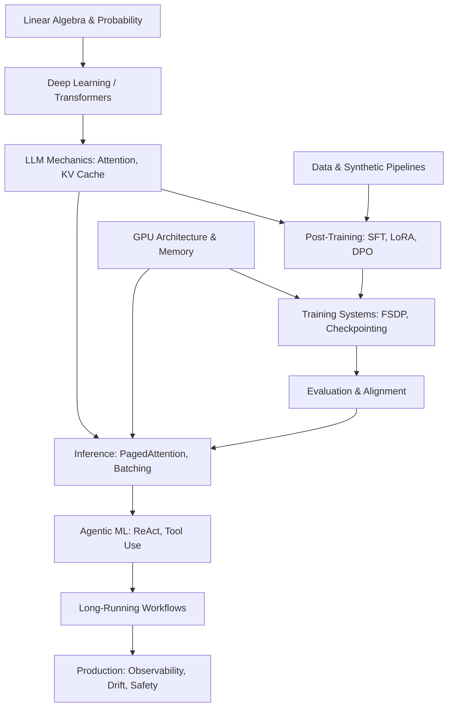

# 🧠 ML-Notes — Single Source of Knowledge (SSK)

> **A comprehensive, production-grade interview preparation system for the Technical Lead, Machine Learning role at A1.**  
> Bridging Mathematics → Algorithms → GPU Execution → Production Systems.

---

## 🎯 Purpose & Scope

This repository is a **Single Source of Knowledge (SSK)** built for the **A1 Technical Lead, ML** interview — a role at the intersection of LLM Research, Systems Engineering, and Product Outcomes.

The core interview hypothesis this repo answers:

> *"Can this candidate take an ML/LLM research idea, turn it into a trainable system, adapt it effectively, deploy it efficiently, integrate it into an agentic product, measure whether it actually works, debug it in production, and continuously improve it under latency, cost, reliability, and safety constraints?"*

Every document follows the **10-Level Depth Framework**, progressing from first principles through to production-grade reasoning.

---

## 📐 Dependency Architecture

Understanding how decisions at the bottom of the stack cascade to the top:

---

## 📊 Priority Matrix

| Priority | Category | Topics | Files |
|:---:|:---|:---|:---|
| **P0** | Agentic ML Systems | ReAct, Tool Routing, Context/Memory Management | [10_AGENTIC_ML_SYSTEMS.md](./10_AGENTIC_ML_SYSTEMS.md) |
| **P0** | Long-Running Workflows | State Persistence, Idempotency, Retries | [11_LONG_RUNNING_WORKFLOW_RELIABILITY.md](./11_LONG_RUNNING_WORKFLOW_RELIABILITY.md) |
| **P0** | Post-Training | SFT, LoRA, DPO, Distillation | [05_POST_TRAINING.md](./05_POST_TRAINING.md) |
| **P0** | LLM & Inference | KV Cache, PagedAttention, Speculative Decoding | [04_TRANSFORMERS_AND_LLMS.md](./04_TRANSFORMERS_AND_LLMS.md) · [09_INFERENCE_SYSTEMS.md](./09_INFERENCE_SYSTEMS.md) |
| **P0** | GPU Architecture | SMs, HBM, Memory Bandwidth, Tensor Cores | [08_GPU_AND_PERFORMANCE.md](./08_GPU_AND_PERFORMANCE.md) |
| **P0** | Evaluation & Reliability | LLM-as-judge, Canarying, System vs Model Metrics | [12_EVALUATION.md](./12_EVALUATION.md) |
| **P1** | Training Systems | PyTorch Autograd, Mixed Precision, DDP/FSDP | [07_TRAINING_SYSTEMS.md](./07_TRAINING_SYSTEMS.md) |
| **P1** | Data Engineering | Synthetic Data, Pipeline Contamination | [06_DATA_AND_SYNTHETIC_DATA.md](./06_DATA_AND_SYNTHETIC_DATA.md) |
| **P1** | Observability | Profiling, Tracing, Distributed Debugging | [14_OBSERVABILITY_AND_DEBUGGING.md](./14_OBSERVABILITY_AND_DEBUGGING.md) |
| **P1** | Systems / ML Design | Architecture Tradeoffs, Cost/Latency Scaling | [16_SYSTEM_DESIGN.md](./16_SYSTEM_DESIGN.md) · [13_PRODUCTION_ML.md](./13_PRODUCTION_ML.md) |
| **P1** | Deep Learning | Attention, Transformers, Cross-Entropy | [02_03_ML_AND_DL_FOUNDATIONS.md](./02_03_ML_AND_DL_FOUNDATIONS.md) |
| **P2** | Classic ML & Python | Concurrency, Algorithms, Basic Statistics | [17_PYTHON_AND_CODING.md](./17_PYTHON_AND_CODING.md) · [02_03_ML_AND_DL_FOUNDATIONS.md](./02_03_ML_AND_DL_FOUNDATIONS.md) |

---

## 📚 Document Index

### Phase 0 — Foundation & Architecture

| File | Description |
|:---|:---|
| [00_ROLE_ANALYSIS.md](./00_ROLE_ANALYSIS.md) | Role competency map, priority matrix, and full dependency graph |

---

### Phase 1 — Core ML & Deep Learning

| File | Description |
|:---|:---|
| [02_03_ML_AND_DL_FOUNDATIONS.md](./02_03_ML_AND_DL_FOUNDATIONS.md) | ML foundations, deep learning mechanics, attention, and backpropagation |

---

### Phase 2 — LLMs & Inference Engine *(P0)*

| File | Description |
|:---|:---|
| [04_TRANSFORMERS_AND_LLMS.md](./04_TRANSFORMERS_AND_LLMS.md) | Attention mechanics, RoPE, KV Cache, MoE architecture |
| [05_POST_TRAINING.md](./05_POST_TRAINING.md) | SFT, LoRA, QLoRA, DPO (with LaTeX derivations), Distillation |
| [09_INFERENCE_SYSTEMS.md](./09_INFERENCE_SYSTEMS.md) | Continuous batching, PagedAttention, Speculative Decoding, cost/latency |

---

### Phase 3 — Systems, Scaling & Hardware *(P0)*

| File | Description |
|:---|:---|
| [07_TRAINING_SYSTEMS.md](./07_TRAINING_SYSTEMS.md) | FSDP, Pipeline/Tensor Parallelism, Gradient Checkpointing |
| [08_GPU_AND_PERFORMANCE.md](./08_GPU_AND_PERFORMANCE.md) | SMs, Tensor Cores, Memory Bandwidth, Kernel Fusion, Arithmetic Intensity |
| [18_DISTRIBUTED_SYSTEMS.md](./18_DISTRIBUTED_SYSTEMS.md) | Distributed system fundamentals for ML workloads |

---

### Phase 4 — Agentic ML Systems *(P0 — A1 Specific)*

| File | Description |
|:---|:---|
| [10_AGENTIC_ML_SYSTEMS.md](./10_AGENTIC_ML_SYSTEMS.md) | ReAct, Tool Routing, Context/Memory management in agentic pipelines |
| [11_LONG_RUNNING_WORKFLOW_RELIABILITY.md](./11_LONG_RUNNING_WORKFLOW_RELIABILITY.md) | State persistence, idempotency, partial failures, probabilistic reliability |

---

### Phase 5 — Production Engineering & Evaluation

| File | Description |
|:---|:---|
| [06_DATA_AND_SYNTHETIC_DATA.md](./06_DATA_AND_SYNTHETIC_DATA.md) | Data pipelines, synthetic data generation, contamination detection |
| [12_EVALUATION.md](./12_EVALUATION.md) | LLM-as-judge, evals design, canarying, regression detection |
| [13_PRODUCTION_ML.md](./13_PRODUCTION_ML.md) | Deployment patterns, serving infrastructure, model lifecycle |
| [14_OBSERVABILITY_AND_DEBUGGING.md](./14_OBSERVABILITY_AND_DEBUGGING.md) | Profiling, distributed tracing, incident debugging |
| [15_SAFETY_AND_ROBUSTNESS.md](./15_SAFETY_AND_ROBUSTNESS.md) | Safety alignment, robustness to adversarial inputs, drift detection |

---

### Phase 6 — Synthesis & Interview Execution

| File | Description |
|:---|:---|
| [16_SYSTEM_DESIGN.md](./16_SYSTEM_DESIGN.md) | Architecture tradeoffs and ML system design patterns |
| [17_PYTHON_AND_CODING.md](./17_PYTHON_AND_CODING.md) | Python concurrency, algorithms, and coding patterns for ML |
| [19_LEADERSHIP_AND_TECHNICAL_JUDGMENT.md](./19_LEADERSHIP_AND_TECHNICAL_JUDGMENT.md) | Principal-level technical judgment, team dynamics, incident leadership |
| [20_INTERVIEW_QUESTION_BANK.md](./20_INTERVIEW_QUESTION_BANK.md) | Curated question bank organized by domain and priority |
| [21_CASE_STUDIES.md](./21_CASE_STUDIES.md) | End-to-end case studies linking theory to production decisions |
| [22_FINAL_SYNTHESIS_PLAYBOOKS.md](./22_FINAL_SYNTHESIS_PLAYBOOKS.md) | Final playbooks for interview day — structured answer frameworks |

---

## 🧭 Study Guide: Recommended Sequence

**Week 1 — P0 Core (Do this first)**
1. `00_ROLE_ANALYSIS.md` — understand the full map
2. `04_TRANSFORMERS_AND_LLMS.md` + `09_INFERENCE_SYSTEMS.md`
3. `08_GPU_AND_PERFORMANCE.md`
4. `10_AGENTIC_ML_SYSTEMS.md` + `11_LONG_RUNNING_WORKFLOW_RELIABILITY.md`
5. `05_POST_TRAINING.md` + `12_EVALUATION.md`

**Week 2 — P1 Depth & Production**
6. `07_TRAINING_SYSTEMS.md` + `18_DISTRIBUTED_SYSTEMS.md`
7. `06_DATA_AND_SYNTHETIC_DATA.md`
8. `13_PRODUCTION_ML.md` + `14_OBSERVABILITY_AND_DEBUGGING.md` + `15_SAFETY_AND_ROBUSTNESS.md`
9. `02_03_ML_AND_DL_FOUNDATIONS.md`

**Week 3 — Interview Execution**
10. `16_SYSTEM_DESIGN.md` + `17_PYTHON_AND_CODING.md`
11. `19_LEADERSHIP_AND_TECHNICAL_JUDGMENT.md`
12. `20_INTERVIEW_QUESTION_BANK.md` → `21_CASE_STUDIES.md` → `22_FINAL_SYNTHESIS_PLAYBOOKS.md`

---

## ⚙️ Content Philosophy

Each document in this SSK is structured to cover:

- **First Principles** — Why does this exist? What problem does it solve?
- **Mechanics** — How does it work at the algorithm level?
- **Mathematics** — Rigorous LaTeX derivations with all variables and tensor dimensions defined
- **GPU Execution** — How does the math map to CUDA kernels, memory bandwidth, and Tensor Cores?
- **Production Systems** — What breaks in production? How do you debug, scale, and optimize?
- **Principal-Level Judgment** — When to use this approach vs. alternatives, and how to defend the tradeoff

---

## 🏷️ Key Technical Themes

`Transformers` · `KV Cache` · `PagedAttention` · `Speculative Decoding` · `LoRA` · `QLoRA` · `DPO` · `FSDP` · `CUDA Kernels` · `Arithmetic Intensity` · `ReAct` · `Tool Use` · `Idempotency` · `LLM-as-judge` · `Synthetic Data` · `Distributed Tracing` · `Safety & Alignment`

---

*This is a living document. All notes are generated and maintained as part of a structured interview preparation system.*
